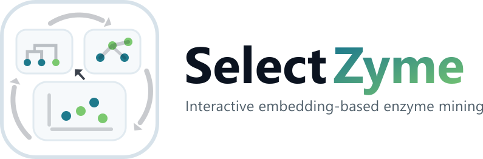
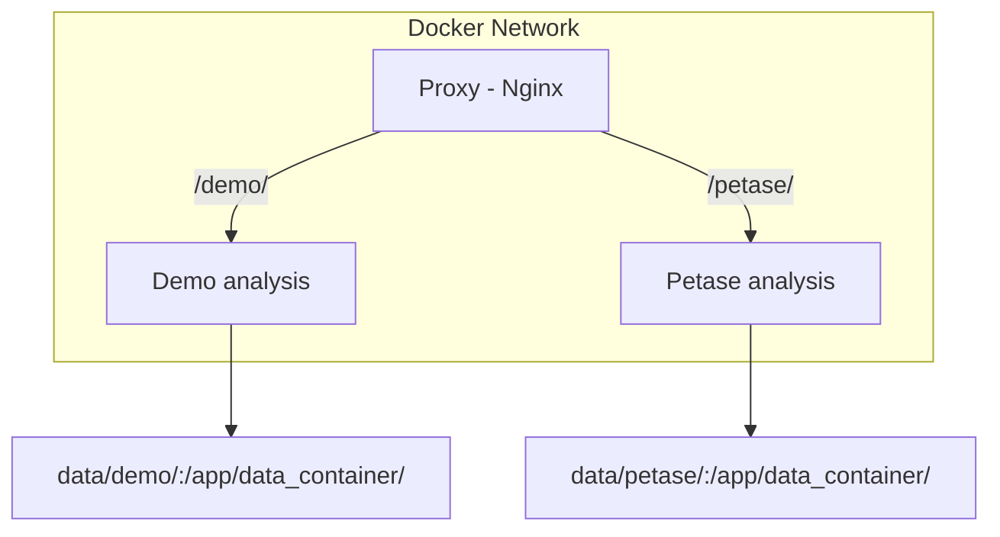
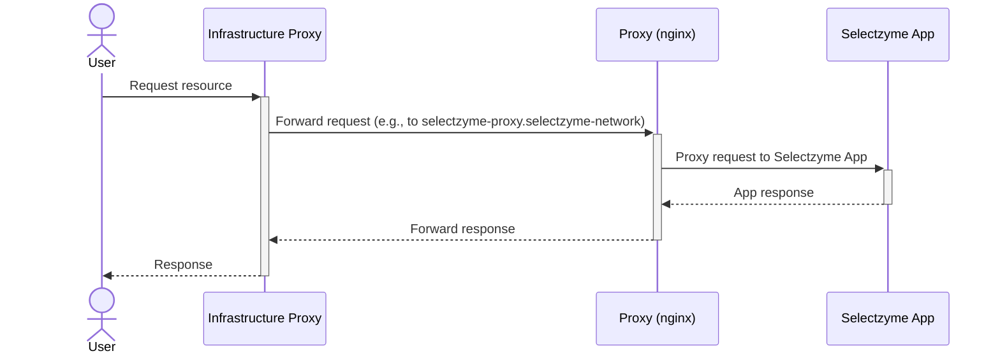

# SelectZyme-app
Web application to host the pre-calculated demo analyses by SelectZyme from [huggingface](https://huggingface.co/davari-group/datasets)



## Install
```
git clone https://github.com/ipb-halle/SelectZyme-app.git
cd SelectZyme-app
docker-compose up
docker-compose down  # shut down services when desired
```
Access the server from your browser at: `localhost/`

## Architecture


## Development
This project uses the following tools to improve code quality:
- [ruff](https://docs.astral.sh/ruff/tutorial/)
  
## License
MIT License

## Citation

This repository contains the source code for the application hosted at [https://selectzyme.app.ipb-halle.de/](https://selectzyme.app.ipb-halle.de/), showing selected pre-calculated case studies for the manuscript:<br>

Felix Moorhoff<sup>*1*</sup>, David Medina-Ortiz<sup>*1*</sup>, Alicja Kotnis<sup>*1*</sup>, Ahmed Hassanin<sup>*1,2*</sup>, Mehdi D. Davari<sup>*1,\**</sup>, <br>“Visualize, Explore, and Select”: A protein Language Model-Based Approach Enabling Navigation of Protein Sequence Space for Enzyme Discovery and Mining<br>
*Journal* 2026, 61, 3463-3476 <br>
https://doi.org/10.64898/2026.03.23.712833 <br>

<sup>*1*</sup><sub>Department of Bioorganic Chemistry, Leibniz Institute of Plant Biochemistry, Weinberg 3, 06120 Halle, Germany</sub> <br>
<sup>*2*</sup><sub>Department of Pharmacognosy, Faculty of Pharmacy, Assiut University, 71526 Assiut, Egypt</sub> <br>
<sup>*\**</sup><sub>Corresponding author</sub> <br>


## Server deployment @ IPB
In order to automatically (re-)start the service (e.g. with a cronjob) please perform these steps:
```
./sz.sh install  # register service 1st time
./sz.sh start
systemctl status sz.service  # test status
./sz.sh stop  # stop service
```
Use `sz.sh update` to update the service.

Additional notes on the current workflow to build docker images with a workflow:
Because of a restricted company network, images (github: packages) are build using a CI workflow. The packages appear in the repo on the right, clicking on them you can change the visibility. They should inherit visibility from the repo but the company can have restrictions so ask the organization owner to enable public visibility of your package (image).

